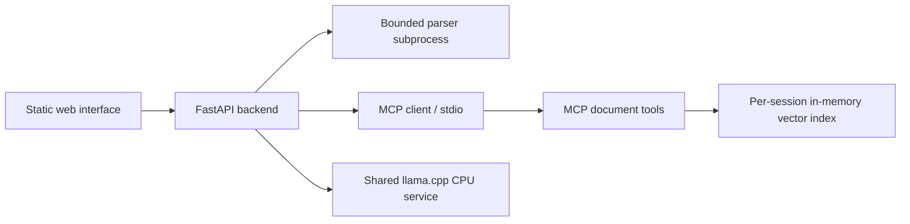

# Sourcebook — Document Q&A

Ask questions about uploaded documents and inspect the passages behind each answer. Sourcebook combines **MCP retrieval**, CPU embeddings, and a **self-hosted open-source language model**. No paid LLM API is used.

**Status:** local application implemented. CPU inference and the MCP workflow have been exercised locally; evaluation results are in [`docs/evaluation-results.json`](docs/evaluation-results.json). Public backend hosting is not provisioned. Docker configuration is supplied; see validation notes below.

## What you can try

- Upload a text-based PDF, DOCX, or UTF-8 TXT, or load the fictional employee handbook.
- Ask an independent question and get an answer with source citations.
- Expand each source to read its exact extracted passage.
- Remove documents or clear your temporary workspace.
- If generation is unavailable or fails validation, inspect clearly labeled retrieved excerpts instead.

Limits: **10 MB/file, five documents/workspace, 100 PDF pages, 150,000 extracted characters and 250 chunks/document.** Scanned PDFs/OCR, password-protected PDFs, and image understanding are excluded. DOCX/TXT cite paragraph/section locations because they have no stable page layout. Extraction of complex tables, headers, and unusual PDF layouts is imperfect.

## Run locally

Install Python 3.12 and [uv](https://docs.astral.sh/uv/), then run from this repository:

```powershell
uv sync --frozen --python 3.12
uv run python scripts/prepare_models.py
```

Preparation downloads about **2.7 GB** of model assets into ignored local folders. It verifies the pinned model and embedding checksums in `models.lock.json`. On Windows it also downloads and checks the official llama.cpp CPU runtime. On Linux/macOS, install a compatible `llama-server` or use Docker.

Start the shared CPU model in one terminal:

```powershell
uv run python scripts/start_model.py
```

Start the application in another terminal:

```powershell
uv run uvicorn app.main:app --host 127.0.0.1 --port 8000
```

Open **http://127.0.0.1:8000**. Load the sample and ask “How many vacation days do employees get?” The application also works in explicitly labeled excerpt mode if the model service is stopped.

Copy `.env.example` to `.env` only if you need to change settings. The app loads it relative to the project directory. Never commit `.env`, tokens, uploaded documents, indexes, or model binaries.

### Model choices

- **Generation:** Qwen3 4B GGUF distributed by Ollama, pinned by SHA-256. Qwen3 is Apache-2.0 licensed. The compact model is a CPU baseline, not a claim of enterprise-grade answer quality. The initial 1.7B comparison is retained in `docs/evaluation-1.7b.json`.
- **Embeddings:** BAAI/bge-small-en, ONNX via FastEmbed, MIT licensed. English-first retrieval, loaded once by the MCP server. Assets come from Qdrant's published download.
- **Serving:** llama.cpp, CPU only, four threads, 8,192-token context, one generation slot. A small Qwen3 ChatML template explicitly closes the thinking prefix so all output tokens are spent on the answer. Native Windows runtime version and Docker image digest are pinned separately.

Model provenance: [Qwen model card](https://huggingface.co/Qwen/Qwen3-4B), [Ollama Qwen3](https://ollama.com/library/qwen3:4b), [FastEmbed](https://github.com/qdrant/fastembed), [llama.cpp](https://github.com/ggml-org/llama.cpp).

## Architecture



Uploads are parsed into text sections and indexed by the MCP `index_document` tool. Questions always trigger the MCP `search_documents` tool; the language model receives only retrieved passages. This is a deterministic retrieval workflow, not an autonomous tool-selecting agent. MCP stays internal, and the model cannot choose another user's session or invoke upload/deletion tools.

The model returns structured statements with supporting source IDs. The backend rejects unknown/missing IDs and attaches citation markers itself. **Valid IDs do not prove that a claim is supported:** model faithfulness remains an evaluation concern. Similarity is a ranking signal, not a calibrated confidence percentage.

Retrieval combines semantic similarity with rare query-word overlap and lightweight English word-ending normalization. The semantic threshold is 0.80; candidates down to 0.75 also need two matching content terms. A second model call checks whether drafted statements follow from cited evidence, address the whole question, and avoid ignoring contradictions in other retrieved passages. This is an additional guard, not an independent factual guarantee: the checker uses the same small model. These ranking constants were exercised on the handbook and the public NIST fixture; they are not calibrated probabilities and need broader validation for other domains.

`app/model.py` is the reusable inference adapter for the future transcript-only YouTube project. Its endpoint can point to one shared private model service. No OpenAI account/key is needed despite the compatible HTTP request format.

## Isolation, retention, and resource limits

- The backend creates unguessable bearer tokens. Only token hashes are held in backend memory; the browser keeps its token in session storage.
- The backend supplies the MCP workspace ID, never a user-selected ID. Documents cannot be listed, searched, or deleted across workspaces.
- Extracted text and vectors stay in memory. Original uploads may briefly use the framework's temporary upload spool and are closed after parsing. No user documents are committed or deliberately retained on disk.
- Workspaces expire after one hour; a cleanup loop removes their server-side indexes within approximately 30 seconds after expiry, once any active operation finishes. Explicit deletion is also available. Browser-displayed answers remain until cleared or the page is reloaded.
- One expensive operation runs at a time; excess requests receive a retry message. Defaults: 20 questions/workspace, 200 questions/day, 100 uploads/day, 100 new sessions/day, 20 active workspaces.
- Counters/indexes are process-local and reset on restart. Run **one API worker**. Multi-instance deployment needs shared quotas and session storage.
- Request bodies are byte-capped even without Content-Length. Document parsing has a 20-second timeout in a separate process and a 768 MB address-space limit on Linux. The Docker API container adds a memory/process limit. Windows local parsing does not have the Linux memory cap.
- No chat history is sent to the model. Each question stands alone. The UI renders document/model text without interpreting HTML.

This is a bounded portfolio demo, not an audited confidential-document service. Use non-sensitive demo files. Public hosting needs HTTPS, explicit allowed origins, and a reverse proxy with upload/concurrency limits. Prompt injection and incorrect model answers remain possible; see the evaluation record.

## Tests and evaluation

```powershell
uv run pytest -q
uv run ruff check --config pyproject.toml app tests scripts
node --check frontend/app.js
uv run python scripts/evaluate.py
```

Unit/integration tests cover malformed inputs, PDF/DOCX/TXT extraction, chunk provenance, request caps, authentication/expiry, cross-workspace retrieval/deletion, model output validation, and actual MCP subprocess initialization/cleanup. These tests need no model download.

The live evaluation needs the app and model running. It uses a small fictional handbook and saves outputs/timings in `docs/evaluation-results.json`. Qwen3 4B passed 19 of 20 fixture checks, with a median response time of 6.8 seconds. The missed case was an unnecessary abstention on remote-work days. Its keyword checks are smoke tests, not a general answer-accuracy or citation-faithfulness score. Do not extrapolate local CPU speed to a shared hosting plan.

## Docker and hosting

Prepare the model files first, then:

```sh
docker compose up --build
```

The API is bound to localhost:8000; the model has no exposed host port. Both containers use CPU. The compose file budgets 6 GB for inference and 2 GB for the API. The native model used approximately 5.34 GB locally; allow additional memory for the operating system (12 GB total is a safer starting point). Benchmark the chosen host before purchase. The Docker daemon was unavailable during initial Windows development, so container execution must be verified before deployment.

For deployment, place an HTTPS reverse proxy in front of the API, configure `QA_ALLOWED_ORIGINS` to your exact GitHub Pages origin, and keep model access private. The shared USD 20–30/month target is a planning estimate, not a purchased hosting plan or guarantee.

GitHub Pages publishes only `frontend/`. The manual **Publish interface** workflow accepts a public HTTPS backend origin and writes it to `config.js` safely. GitHub Actions secrets cannot make a secret embedded in static JavaScript private. Use backend environment configuration for credentials.

Without a backend origin, the public Pages interface enters a clearly labeled **prepared sample demo**. It serves two recorded model answers from `frontend/demo.json`; live uploads are disabled and other questions are not answered. Export these examples with `uv run python scripts/build_demo.py` after a successful evaluation. This preview is not the live hosted RAG backend.

## Repository map

| Location | Responsibility |
|---|---|
| `frontend/` | Responsive, dependency-free interface; GitHub Pages compatible |
| `app/main.py` | HTTP API, session lifecycle, quotas, upload orchestration |
| `app/extraction.py`, `app/parse_worker.py` | Bounded extraction and provenance |
| `app/mcp_client.py`, `app/mcp_server.py` | MCP lifecycle and document tools |
| `app/retrieval.py` | CPU embeddings and isolated vector search |
| `app/model.py` | Shared local-model adapter and citation validation |
| `tests/` | Offline regression tests and MCP integration checks |
| `scripts/` | Model preparation, serving, and live evaluation |
| `docs/PROJECT_BRIEF.md` | Agreed scope and handoff context for both projects |

## Credits

Inspired by the MCP teaching examples in [Dave Ebbelaar's AI Cookbook](https://github.com/daveebbelaar/ai-cookbook/tree/main/mcp). This is a separate implementation with an upload pipeline, isolated sessions, a web interface, local generation, and tests. Third-party libraries and model assets retain their respective licenses; model binaries are downloaded separately, not redistributed in this repository.

### Informal question wording regression

A follow-up fix restricts verification to cited evidence and distinguishes informal eligibility questions from explicit accrual questions. The exact question "when does employee earn vacation" now returns the documented six-month availability rule. All eight focused live checks passed; see `docs/wording-regression.json`. These supplement the earlier 20-case baseline; they do not replace it or establish general accuracy.

### Broader format reliability pass

Run `uv run python scripts/evaluate_reliability.py` with the backend/model running. It creates synthetic DOCX, two-page PDF, and TXT uploads and checks answers and citation locations through the real API/MCP path. The 12 recorded cases cover tables, informal wording, missing facts, and a document instruction attempting to alter a fact. All 12 are accepted after review of one exact cited missing-policy answer; the original 11/12 automated count and unchanged outputs are retained in `docs/reliability-results.json`. Offline suite: 25 tests.

DOCX extraction preserves paragraph/table order and repeats each table's first row as context for subsequent rows. Citations identify table and row. This assumes the first row is useful header context. Merged and nested DOCX tables are rejected with an explanation because the current parser cannot interpret them reliably. Unusually large tables and complex PDF layouts remain limitations. These synthetic fixtures do not substitute for representative real documents. Future phases and resume notes are in `docs/ROADMAP.md`.

### Pre-hosting acceptance checks

Run `uv run python scripts/evaluate_prehosting.py`. The runner downloads one checksum-pinned public NIST SP 1300 PDF into ignored `.runtime/`, then exercises it alongside a long synthetic DOCX and conflicting policy fixtures. Reports are retained under `docs/prehosting-*.json`. Source: https://nvlpubs.nist.gov/nistpubs/SpecialPublications/NIST.SP.1300.pdf . The nine-page guide is a real public document; the long DOCX and conflict cases are controlled synthetic fixtures.

Short context-dependent questions such as “When does it open?” now ask the user to name the subject. This is a deliberately narrow grammar guard, not a general ambiguity detector. Questions remain independent; chat history is not supplied to the model. Conflicting policies may produce a cautious refusal rather than a complete comparison. Verification can detect only conflicts in retrieved passages, not every passage in every uploaded document.

### Pre-hosting review completed

See [docs/PREHOSTING_REVIEW.md](docs/PREHOSTING_REVIEW.md) for results and known limits. Offline tests: 41 passed; pre-hosting acceptance: 13/13; format cases: 12/12. A later handbook rerun exposed a founding-date error, now covered by a deterministic missing-origin-evidence guard and four passing targeted API cases. Failed runs remain in the repository; these separate suites are not a single general accuracy score. Next phase: CPU hosting benchmarking.
